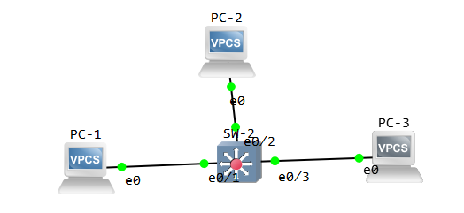
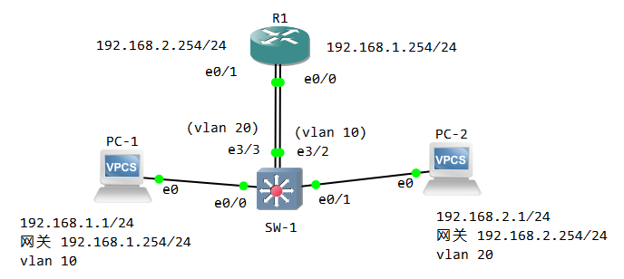
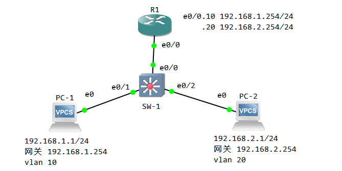
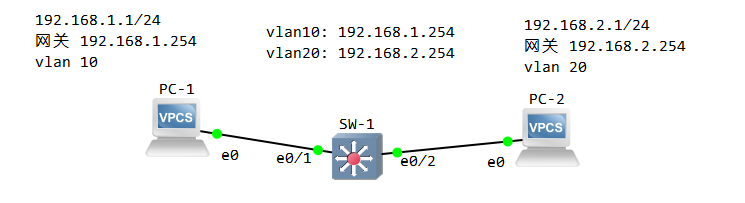

#### 概念

##### vlan

每个 vlan 都是一个单独的广播域。vlan 是一个二层的概念，从一个 vlan 端口进入的广播帧，将从所有其他相同的 vlan 口发出。vlan 间互不影响，一般情况下，帧的转发只能在属于同一个 vlan 的端口间进行。

默认情况下，所有交换接口都处于 vlan 1。可以通过配置交换机，创建新的 vlan，并将交换端口划入 vlan 中。



如上图，通过划分 vlan，可以使三台 PC 处于不同的广播域

##### trunk

但是，如果局域网中有两台交换机呢？另一台交换机怎么知道发过来的帧它的 vlan 号是多少？这可以通过配置 trunk（干道） 来实现

在trunk链路上应用较广泛的协议是 dot1q，在进入 trunk 前添加tag，离开 trunk 后取出tag，其中就包含了 vlan号

因此，广播帧除了送往vlan相同的端口，还将送往 trunk 接口


##### vlan间路由

不同的 vlan 之间默认无法通信，如果要通信则需要借助三层设备（路由器，三层交换机等），下面我们来介绍 vlan 间通信的三种方法


注：二层交换机不能划分 vlan，但是存在一些其他的交换机，比如 vlan交换机支持划分 vlan，三层交换机则不仅支持划分 vlan，还具有路由功能。这里使用 GNS3 中的三层交换机来操作 vlan，相应的 IOU专用镜像 见我的另一篇 GNS3 安装。

以下内容学习自 [晴刃](https://www.qingsword.com) 与 [vinsony](http://ccietea.com/)


#### 第一种方式 - 依靠三层设备的物理接口进行转发



先来看一下这张网络拓扑图，一台路由器一个交换机，两台PC

两台 PC 处于不同的子网，网关分别设在 路由器的 两个接口上

交换机划分 vlan，e0/0 和 e3/2 处于 vlan 10， e0/1 和 e3/3 处于 vlan 20

这样就可以通过一台路由器实现两个vlan 间的通信，下边分析一下封包的流向和传递过程


PC-1 ping PC-2 的过程就是 PC-1 向 PC-2 发送一个 icmp 报文，然后 PC-2 收到报文发送一个 Reply 给 PC-1


分析：

1. PC-1 的网卡 ip 是 192.168.1.1/24，报文要去往 192.168.2.1/24。但是该地址不在自己的子网内，因此 PC-1 需要先把报文发送给自己的网关 192.168.1.254，由网关代为转发。该报文的源地址是 192.168.1.1，目的地址是 192.168.1.254。
2. 报文不能在链路上传输，二层是不认识ip 的，所以需要进一步封装。也就是把报文封装为二层的数据帧，但是现在还不知道 192.168.1.254 的 mac 地址，因此没有办法发送到 网关 192.168.1.254
3. 为了得到 192.168.1.254 的 mac 地址，PC-1 发出一个arp 发现报文，源mac 为 MAC-PC1，目的mac 为 ff:ff:ff:ff:ff:ff（广播地址）。
4. 我们可以通过在 PC1-SW1 抓包抓取到该 arp 报文，报文内数据如下： -1536837515902.png)
5. 交换机 SW-1 收到分片，成帧之后发现目的mac 是一个广播地址（ff:ff:ff:ff:ff:ff），于是把帧从所有其他的 vlan 10 端口泛洪出去。在这里，帧从 e3/2 接口出去，到达 e0/0
6. 路由器 R1 成帧后，发现mac 为广播地址，进行解封装，取出 arp 数据报文，发现目的 ip 地址就是自己。（如果目的ip 地址不是自己，默认丢弃该报文。所以 tcpdump 等抓包软件需要将 网卡/设备置于 混杂模式，才可以抓取任意经过该网卡/设备的报文）
7. R1 发出一个 arp 回应报文，源 ip 是 192.168.1.254，目的 ip 是 192.168.1.1。封装成帧，源mac 是MAC-R1e00，目的mac 是MAC-PC1。从 e0/0 发回去
8. 交换机成帧后拿到目的mac MAC-PC1，查找 mac 地址转换表，将帧从 e0/0 转发出去
9. 由于交换机是透传的（怎么进来的还怎么出去），我们同样在 PC1-SW1 链路上抓取到arp 回应报文，数据如下： -1536837515903.png)
10. PC-1 成帧后，发现目的mac 是自己。进一步解封装，目的ip 是自己，于是进行处理，知道了 192.168.1.254 的 mac 地址 MAC-R1e00。
11. 然后 PC-1 就可以发出icmp 报文（ping 在底层是icmp 报文），源ip 192.168.1.1，目的ip 192.168.2.1（PC-2），源mac MAC-PC1，目的mac MAC-R1e00。
12. 交换机查询mac 地址转换表，从 e3/2 转发出去，报文到达 R1
13. R1 发现 目的mac 是自己，解封装。取出目的 ip 192.168.2.1
14. 因为 R1 的 e0/1 接口直接连接到 192.168.2.0/24 子网，因此路由器可以直接学习到去往该子网的路由
15. 通过查询路由表，从 e0/1 转发出去，源mac 替换为自己的mac MAC-R1e01（如果不替换，回包将无法收到），目的mac 为 192.168.2.1（PC-2） 的 mac 地址，该地址通过向 192.168.2.0/254 子网发出 arp 报文广播得到
16. 交换机把数据 从除了 e3/3 之外的所有 vlan 20 接口泛洪出去
17. 帧通过 e0/1 接口出去到达 e0
18. PC-2 发现目的 是自己，收到报文，并发出 reply 的回应报文

```shell
# PC-1
ip 192.168.1.1/24 192.168.1.254

# PC-2
ip 192.168.2.1/24 192.168.2.254

# SW-1
vlan 10
    name vlan10
    vlan 20
    name vlan20
    exit

int e 0/0
    switchport mode access
    switchport access vlan 10
    int e 0/1
    switchport mode access
    switchport access vlan 20
    int e 3/2
    switchport mode access
    switchport access vlan 10
    int e 3/3
    switchport mode access
    switchport access vlan 20
    end

show vlan brief

# R1
int e0/0
  ip addr 192.168.1.254 255.255.255.0
  no shut
  int e0/1
    ip addr 192.168.2.254 255.255.255.0
    no shut
    end

show ip interface brief
```


上述方式虽然简便，但是却使用了路由器的两个接口。路由器的接口通常很少很宝贵，造成了极大的浪费

下面的方式只需要使用路由器的一个接口就可以解决问题


#### 第二种方式 - 单臂路由





这里将路由器 R1 的 e0/0 配置两个 子接口，分别作为 PC-1 和 PC-2 的网关

路由器与交换机之间的链路 配置为 干线（trunk），运行 dot1q 协议

```shell
# PC配置（PC-1）
ip 192.168.1.1/24 192.168.1.254

# PC-2
ip 192.168.2.1/24 192.168.2.254

# 交换机配置(SW-1)
vlan 10
    name vlan10
    vlan 20
    name vlan20
    exit

int e0/1
    swi mod acc
    swi acc vlan 10
    int e0/2
    swi mod acc
    swi acc vlan 20
    int e0/0
    swi trunk enc dot1q
    swi mod trunk
    swi trunk  allow vlan all
    end

show vlan brief

# R1 配置 子接口
int e0/0
    no shut
    int e0/0.10
    enc dot1q 10
    ip addr 192.168.1.254 255.255.255.0
    no shut
    int e0/0.20
    enc dot1q 20
    ip addr 192.168.2.254 255.255.255.0
    no shut
    end

show ip interface brief
```


路由器的转发处理过程是很复杂的，上边的方法每次通信都需要经过 解除tag，路由，贴上tag 一系列过程，并且会对路由器与交换机之间的链路造成很大的负荷

下边的方法利用 交换机的 SVI 接口 来实现更优的解决方案


#### 第三种方式 - 三层交换机的 SVI 接口



```shell
# SW-1
conf t
	vlan 10
	name vlan10
	vlan 20
	name vlan20
	
	int e0/1
	sw mod acc
	sw acc vlan 10
	int e0/2
	sw mod acc
	sw acc vlan 20
	
	int vlan 10
	no shut
	ip addr 192.168.1.254 255.255.255.0
	int vlan 20
	no shut
	ip addr 192.168.2.254 255.255.255.0
	end

# PC-1
ip 192.168.1.1/24 192.168.1.254

# PC-2
ip 192.168.2.1/24 192.168.2.254
```


目前在我的模拟器上运行失败了.. 调试好再更新