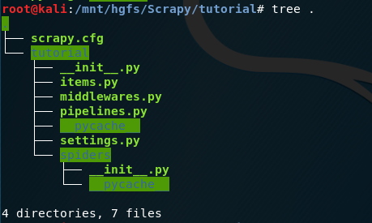

#### scrapy 是什么

scrapy 是一个框架，用来爬取网站，提取结构化数据，以便后续的数据处理


#### 一个简单的爬虫样例

```python
import scrapy


class QuotesSpider(scrapy.Spider):
    name = "quotes"
    start_urls = [
        'http://quotes.toscrape.com/tag/humor/',
    ]

    def parse(self, response):
        for quote in response.css('div.quote'):
            yield {
                'text': quote.css('span.text::text').extract_first(),
                'author': quote.xpath('span/small/text()').extract_first(),
            }

        next_page = response.css('li.next a::attr("href")').extract_first()
        if next_page is not None:
            yield response.follow(next_page, self.parse)
```


保存为 `quotes_spider.py` 文件，然后在终端输入 `scrapy runspider quotes_spider.py -o quotes.json` ，等待爬虫运行结束，爬取的结果可以在 quotes.json 中看到

scrapy 从 start_urls 中定义的 URL 开始，获取网页响应，然后调用函数 parse 处理响应内容 


#### 安装

如果你使用 conda 管理你的 python 环境，运行 `conda install -c conda-forge scrapy` 

如果你使用 pip ，运行 `pip install Scrapy` 

如果使用 python3，提示找不到 `Python.h` ，需要额外安装 `apt-get install python3-dev` 


#### 创建一个 scrapy 项目

编写爬虫代码前，首先创建一个 scrapy 项目，运行

`scrapy startproject tutorial` 

在当前目录下会创建 tutorial 文件夹，我们的 爬虫代码都会放在这里，目录结构如下




scrapy.cfg 是配置文件

tutorial 是一个 python 模块

接下来编写第一个爬虫， `vim tutorial/spider/quotes_spider.py` 

```python
import scrapy

""" scrapy.Spider 子类定义了一些属性和方法
name: 用来标识一个爬虫
start_requests: 返回包含 request 对象的迭代器，scrapy 调度这些请求，返回 response 对象
parse: 处理返回的 response 对象
"""
class QuotesSpider(scrapy.Spider):
    name = "quotes"

    def start_requests(self):
        urls = [
            'http://quotes.toscrape.com/page/1/',
            'http://quotes.toscrape.com/page/2/',
        ]
        for url in urls:
            yield scrapy.Request(url=url, callback=self.parse)

    def parse(self, response):
        page = response.url.split("/")[-2]
        filename = 'quotes-%s.html' % page
        with open(filename, 'wb') as f:
            f.write(response.body)
        self.log('Saved file %s' % filename)
```


运行这个爬虫，只需要在我们的爬虫项目的根目录下，执行 `scrapy crawl quotes` 

这里直接将响应的文本写入了文件 `quotes-1.html` ，所以在文件中我们可以看到对应的 html 代码


前边我们只完成了 start_urls，而没有重写 start_requests 方法，这是因为默认的 start_request 方法会使用 start_urls 来创建初始化请求，因此二者效果是一样的。


#### scrapy shell

让我们来运行一个 scrapy shell

`scrapy shell 'http://quotes.toscrape.com/page/1/'` 

在 shell 中，我们试着使用 css 选择器来处理 response 对象

```shell
>>> response.css('title')
[<Selector xpath='descendant-or-self::title' data='<title>Quotes to Scrape</title>'>]
>>>
```

`response.css('title')` 返回结果是一个 类列表 的对象，包含一系列的 Selector 对象

我们使用 `css(title::text)` 获取 title 元素中的 text 属性

```shell
>>> response.css('title::text').extract()
['Quotes to Scrape']
>>> response.css('title').extract()
['<title>Quotes to Scrape</title>']
>>>
```

提取选择器列表中第一个元素有两种方法

```shell
>>> response.css('title::text').extract_first()
'Quotes to Scrape'
>>> response.css('title::text')[0].extract()
'Quotes to Scrape'
>>>
```

除了 `extract` ，还可以使用 `re()` 正则表达式进行更精确的提取

想要快速定位到你感兴趣的元素标签，可以使用 firebug 等浏览器拓展


scrapy 还支持 xpath 表达式提取

```shell
>>> response.xpath('//title')
[<Selector xpath='//title' data='<title>Quotes to Scrape</title>'>]
>>>
```


事实上，xpath 比 css 有更加强大的选择功能，css 的框架底层被转化为 xpath。

学习构建 xpath 选择器，将使编写爬虫变得更加容易。


#### 练习

上边，我们了解了一点关于 选择器和提取 的一些内容

然后我们完成之前的项目 -- 从 quotes.toscrape.com 网站提取 每一条名言和它们的作者


在编写爬虫代码之前，我们使用 scrapy shell 来寻找提取数据 的方法

打开浏览器访问quotes网站，或者使用 view(response) 来查看网页源代码

```html
<div class="quote" itemscope itemtype="http://schema.org/CreativeWork">
        <span class="text" itemprop="text">“The world as we have created it is a process of our thinking. It cannot be changed without changing our thinking.”</span>
        <span>by <small class="author" itemprop="author">Albert Einstein</small>
        <a href="/author/Albert-Einstein">(about)</a>
        </span>
        <div class="tags">
            Tags:
            <meta class="keywords" itemprop="keywords" content="change,deep-thoughts,thinking,world" /    > 
            
            <a class="tag" href="/tag/change/page/1/">change</a>
            
            <a class="tag" href="/tag/deep-thoughts/page/1/">deep-thoughts</a>
            
            <a class="tag" href="/tag/thinking/page/1/">thinking</a>
            
            <a class="tag" href="/tag/world/page/1/">world</a>
            
        </div>
    </div>
```


我们简单的使用 css 选择器，`css('div.quote')` 提取每一条名言，在当前页面我们一共提取到十条。（div 是标签选择器，.quote 是类选择器，这些是基础的 css 知识）

我们选择第一条，  `response.css(div.quote)[0]` 返回一个选择器，在此基础上，可以进一步提取出 标题，作者和标签

```shell
>>> one = response.css('div.quote')[0]
>>> one.css('span.text::text').extract_first()
'“The world as we have created it is a process of our thinking. It cannot be changed without changing our thinking.”'
>>> one.css('small.author::text').extract_first()
'Albert Einstein'
>>> one.css('div.tags a.tag::text').extract()
['change', 'deep-thoughts', 'thinking', 'world']
>>>
```


确定了如何提取我们需要的信息后，我们将每一条语句结合起来

```shell
for quote in response.css("div.quote"):
...     text = quote.css("span.text::text").extract_first()
...     author = quote.css("small.author::text").extract_first()
...     tags = quote.css("div.tags a.tag::text").extract()
...     print(dict(text=text, author=author, tags=tags))
```


接下来就可以编写爬虫代码，仅需要将 print 改为 yield 即可

```python
import scrapy


class QuotesSpider(scrapy.Spider):
    name = "quotes"
    start_urls = [
        'http://quotes.toscrape.com/page/1/',
        'http://quotes.toscrape.com/page/2/',
    ]

    def parse(self, response):
        for quote in response.css('div.quote'):
            yield {
                'text': quote.css('span.text::text').extract_first(),
                'author': quote.css('small.author::text').extract_first(),
                'tags': quote.css('div.tags a.tag::text').extract(),
            }
```


yield 是 python 关键字，用于惰性计算，即 只有在调用 next 方法后才继续执行，而 for 循环语句自动调用 next 方法

运行这个爬虫！我们将得到我们想要的信息

`scrapy crawl quotes` 


返回结果默认输出在屏幕上，我们试着将结果存储下来

`scrapy crawl quotes -o quotes.json` 


如果该文件已经存在，scrapy 将在文件末尾追加内容。因此连续执行两次后，json 文件中得到一个错误的结果

我们可以选择其他文件格式，比如 quotes.jl 格式，jl（json lines）不会出现上边的问题

在处理小的项目时，使用单文件是足够的。但是在处理数据量很大的项目时我们就必须使用其他手段了，scrapy 提供了 `item pipeline` 用来处理数据的存储问题。


#### 爬取更多网页

之前我们只是爬取了两个页面，一个页面包含十条记录，这两个页面是我们直接添加在 `start_urls` 中的。

该网站共有十个页面，100条记录，我们要全部爬取到。

我们可以追踪页面中的链接来实现自动的查找其他页面，直到构建好整张站点地图。


首先来找到链接，先查看网页源码，找到链接所在的位置

```html
<nav>
        <ul class="pager">
            
            
            <li class="next">
                <a href="/page/2/">Next <span aria-hidden="true">&rarr;</span></a>
            </li>
            
        </ul>
    </nav>
```


打开 scrapy shell，尝试提取 链接

`scrapy shell 'http://quotes.toscrape.com/page/1/'` 

```shell
>>> response.css('nav ul.pager li.next a::attr(href)').extract_first()
'/page/2/'
>>>
```


这里使用 response.urljoin 来处理一个相对路径。在 parse 函数中，我们又返回了新的 Request 对象，它将继续被 scrapy 调度器处理，直到没有新的 Request 为止。scrapy 调度器会自动忽略已经访问过的 URL，因此不用担心重复访问。


除了 scrapy.Request，我们还可以使用 response.follow 来替代，并且 response.follow 支持相对地址，因此不需要再调用 response.urljoin 来进行地址转换。如果传入的参数是一个 a 标签，response.follow 还可以自动处理它的 href 属性，比如 `response.follow(response.css('li.next a')[0])` ，这使代码更加简洁。


#### 练习二

尝试提取作者信息

追踪页面中的 作者链接，提取作者标题，出生日期，简介等信息

```python
#!coding: utf-8
import scrapy


class QuotesSpider(scrapy.Spider):
    name = "quotes"

    def start_requests(self):
        urls = [
            'http://quotes.toscrape.com',
        ]
        for url in urls:
            yield scrapy.Request(url=url, callback=self.parse)
    
    def parse(self, response):
        for quote in response.css('div.quote'):
            yield {
                'text': quote.css('span.text::text').extract_first(),
                'author': quote.css('small.author::text').extract_first(),
                'tags': quote.css('div.tags a.tag::text').extract(),
            }

        for href in response.css('li.next a'):
            yield response.follow(href, callback=self.parse)
        for href in response.css('.author+a'):
            yield response.follow(href, callback=self.parse_author)

    def parse_author(self, response):
        yield {
            'author-title': response.css('h3.author-title::text').extract_first(),
            'author-born-date': response.css('.author-born-date::text').extract_first(),
            'author-description': response.css('.author-description::text').extract_first(),
        }
```


#### 传参

为爬虫程序传递参数，使用 `-a tag=humor` 选项，可以传给 Spider 的 `__init__` 方法。然后我们使用 self.tag 访问到该属性。

