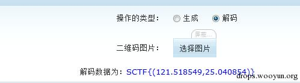

## have fun with misc

#### 0x00 引言

如何做好misc题

- 细心 50%
- 套路 40%
- 散发的思维 10%


比赛中的misc

- 基本是一些套路性的东西，也有些是脑洞


misc题目包含哪些内容

- encode 编码

  - bin（二进制），dec（十进制），hex（十六进制）
  - 各种古典密码

  - 条形码
  - 二维码
  - base全家桶
    - base64 --> [base64 编码图片](http://www.atool.org/img2base64.php)
    - base32
    - base16
  - url 编码
  - ascii 编码
  - 摩尔斯电码
  - 曼彻斯特编码/差分曼彻斯特
- forensic&stego （取证和隐写）
  - 图片隐写（*）
    - [各种文件格式](https://en.wikipedia.org/wiki/List_of_file_signatures) 
  - 音频，视频隐写
  - 流量分析（*）


---------------------------------


#### 0x01 编码

二进制，十进制，十六进制的转化

```python
>>> bin(99)
'0b1100011'
>>> int("1100011", 2)
99

>>> hex(99)
'0x63'
>>> int("63", 16)
99
```


Base64 编码

均为可见字符

特点

- base64 结尾可能会有 `=` 号，但最多有 2 个
- base32 结尾可能会有 `=` 号，但最多有 6 个
- 根据 base 的不同，字符集会有所限制
- **= 也就是 3D**

工具

```python
>>> import base64
>>> base64.b64encode("ctf is fun")
'Y3RmIGlzIGZ1bg=='
>>> base64.b64decode("Y3RmIGlzIGZ1bg==")
'ctf is fun'
```

或者 linux 下

```shell
> echo -n "KJDEGNBQGQZA====" | base32 -d
RFC4042

> echo -n "RFC4042" | base32
KJDEGNBQGQZA====
```


url 编码

特点

- 大量的百分号

%27%22


unicode 编码

源文本： `The`

&#x [Hex]: `&#x0054;&#x0068;&#x0065;`

&# [Decimal]: `&#00084;&#00104;&#00101;`

\U [Hex]: `\U0054\U0068\U0065`

\U+ [Hex]: `\U+0054\U+0068\U+0065


HTML 实体编码

网页中需要出现特殊符号的时候，如 < > 


ADFGX编码

对照ADFGX密码表


给一段密文 `FA XX DD AG FF XG FD XG DD DG GA XF FA` 

flagxidianctf 
提交：flag_Xd{hSh_ctf:flagxidianctf}


#### 0x02 Stego（隐写术）

图种 -- 隐藏信息

先制作一个1.zip，把想要隐藏的东西放进去，再需要一张jpg图片2.jpg，然后就可以执行一个命令 copy /b 2.jpg+1.zip output.jpg。就可以得到一张图种，这是利用了copy命令，将两个文件已二进制方式连接起来，生成output.jpg的新文件。而在jpg图片格式中，是有结束符的，即16进制FF D9，利用winhex可以看到正常的jpg结尾都是FF D9的，使用图片查看器会忽视jpg结束符之后的内容，所以我们附加的zip，自然也就不会影响到图像的正常显示。

这种类型的隐写也是比较容易被发现的，如果发现是jpg图片的话，观察文件结束符之后的内容，查看是否附加的内容，正常图片都会是FF D9结尾的。还有一种方式来发现就是利用binwalk这个工具，在kali下自带的一个命令行工具。（为方便桌面和kali vmware虚拟机同时操作，点击 虚拟机->设置->选项->共享文件夹，添加需要共享的文件夹，共享后将被挂载在 /mnt/hgfs 目录下）

利用binwalk可以自动化的分析图片中附加的其他的文件，其原理就是检索匹配文件头，常用的一些文件头都可以被发现，然后利用偏移可以配合winhex/010editor或者是dd分割出隐藏的部分，或者 binwalk -e 自动化提取。

`dd if=output.jpg of=dd-ex.zip bs=1 skip=93786` 

[dd 命令详解](https://blog.csdn.net/liumang_D/article/details/3899462) 

`binwalk -e output.jpg` 

binwalk 根据文件头匹配文件类型，支持自动化提取

载入 010editor 查看

010editor 用来分析 16进制，提供的模板功能很好用


LSB隐写

上面说到的隐藏方式，是利用了增加数据的方式，把数据直接增加在了jpg后面。还有另一类隐藏的方法，就是利用了修改数据的方式来隐藏自己传递的信息。

一种常见的方式是利用LSB来进行隐写，LSB也就是最低有效位 (Least Significant Bit)。原理就是图片中的像数一般是由三种颜色组成，即三原色，由这三种原色可以组成其他各种颜色，例如在PNG图片的储存中，每个颜色会有8bit，LSB隐写就是修改了像数中的最低的1bit，在人眼看来是看不出来区别的，也把信息隐藏起来了。譬如我们想把’A’隐藏进来的话，如下图，就可以把A转成16进制的0x61再转成二进制的01100001，再修改为红色通道的最低位为这些二进制串。


图4.png


图4.png


Stegsolve 工具

打开之后，使用Stegsolve——Analyse——Frame Browser进行分通道扫描，这个可以浏览三个颜色通道中的每一位，可以在红色通道的最低位，发现一个二维码，然后可以扫描得到结果。


再解一下qrcode，用在线的就可以http://tool.chinaz.com/qrcode/，得到了flag{AppLeU0}，如果是隐写的使用了ascii的话，可以使用Stegsolve——Analyse——Data Extract来查看ascii码。

在这个过程中，我们要注意到，隐写的载体是PNG的格式，如果是像之前的jpg图片的话就是不行的，原因是jpg图片对像数进行了有损的压缩，你修改的信息可能会被压缩的过程破坏。而PNG图片虽然也有压缩，但却是无损的压缩，这样子可以保持你修改的信息得到正确的表达，不至于丢失。BMP的图片也是一样的，是没有经过压缩的，可以发现BMP图片是特别的大的，因为BMP把所有的像数都按原样储存，没有压缩的过程。


GIF文件头修复


GIF逐帧播放

gif和别的图片最大的区别就是gif是动态图，它是可以由多帧组成的可以顺序播放的，有的题就是把播放的时间弄得特别慢，几乎就不会动的，所以我们可以用工具一帧一帧的观察图片。Stegsolve就带有这种功能。

Stegsolve——Analyse——Frame Brower就可以看到是有8帧的图片，有点重叠不太好观察，也可以用Namo_GIF_gr这个工具。得到了PASSWORD is Y2F0Y2hfdGhlX2R5bmFtaWNfZmxhZ19pc19xdW10ZV9zaW1wbGU=。很明显，这个时候PASSWORD是经过的编码的，我们可以看到字符范围是0-9a-Z结尾还有=，所以判断是base64编码，解码得到了catch_the_dynamic_flag_is_qumte_simple。这个就是和编码方式结合，传递一些可疑的数据，隐写术常常会与加解密或编码结合在一起，对一些常见的编码和加密方法也要了解，得到密文的字符范围和长度能发现这是什么加密或者是编码。


数据在隐藏的时候，我们常常是需要先分析是数据隐藏在哪里，也就是他在利用是什么做载体，之后才可以进一步的分析是加密或编码的。这也就是说我们要对一个图片的格式要有了解，才能知道哪些地方是可疑的，哪些是可以隐藏起信息的，会有冗余的成分在。举个例子吧，比如给了一个jpg的图片。除了我们之前说到的隐藏在结束符之后的信息，jpg图片还可以把信息隐藏的exif的部分。exif的信息是jpg的头部插入了数码照片的信息，比如是用什么相机拍摄的。这些信息我们也是可以控制的，用查看属性的方式可以修改一部分的信息，还可以用exif编辑器来进行编辑。Power_exif这个可以用来编辑。


图片11.png

可以看到flag{AppLeU0}，就是需要了解隐藏信息的地方，隐写术有的时候难，就是难在了一张图片有太多的地方可以隐藏信息了，有的时候根本连隐藏的载体都找不到，在你的眼里他就是一张正常的图片。


一般图片隐写有几步：

- 如果是jpg图片     右键属性，查看详细信息
- binwalk 看有没有夹带其他文件，文件类型是否正确
- 010editor/winhex 查看二进制数据 有无异常
- Stegsolve 查看每个通道的信息，LSB提取


word中的隐写技巧

- 白色背景下字体调为白色
- 设置->显示->隐藏文字
- 更多


其他技巧：

- strings 搜索明文字符串
- 修改图片宽高度
- pyc反编译
- 二维码，条形码
- crc爆破
- zip密码爆破
- 磁盘挂载，有些直接挂载，有些需要修复
- 音频隐写
  - 频谱
  - 波形
- PS切图，反色


- 奇怪的编码


-----------------------------


#### 0x03 流量分析


0x04 

 SU线上赛
11/5-11/11
这个比赛是江苏省内多个高校联合的招新赛，将作为Asuri招新赛，题目比较简单，可以作为校内赛的热身赛，比赛奖励丰富，有比较多的物质奖励，但是没有证书，不能认定学分。


NUAACTF线下赛
时间未定
这个比赛是校内竞赛，有教务处认定，颁发证书，可以认定学分的比赛。

 


（完）


#### 0x04

------

有一些情况下，我们也是没有现成的工具来完成的，可以自己写一些简单的程序来辅助我们进行分析，或者是加解密。比如sctf的misc400的题目，就需要用到一些简单的编程。题目给出了一个png图片，需要我们找到有SCTF{}标志的flag。

这个题需要我们对于png图片的格式有一些了解，先用stegsolve查看一下，其他的LSB之类的并没有发现什么问题，然后看了一下结构发现，有一些异常的IDAT块。IDAT是png图片中储存图像像数数据的块。Png图片格式的扩展阅读可以看看这篇

http://www.cnblogs.com/fengyv/archive/2006/04/30/2423964.html

有详细的介绍。


图片12.png

可以用pngcheck来辅助我们观察，可以看得更加清晰。pngcheck.exe -v sctf.png


图片13.png

可以看到，正常的块的length是在65524的时候就满了，而倒数第二个IDAT块长度是45027，最后一个长度是138，很明显最后一个IDAT块是有问题的，因为他本来应该并入到倒数第二个未满的块里。


图片14.png

我们用winhex把这一部分异常的IDAT块给扣出来。然后就是要研究研究这个块是什么情况，发现了载体之后就是要想办法找出他的规律。观察那一部分的数据，可以看到是16进制的78 9C开头的，百度一下分析是zlib压缩的标志。在png的百度百科里也可以查到PNG的IDAT是使用从LZ77派生的无损数据压缩算法，可以用zlib解压。那么就尝试用zlib来解一下这段数据。Zlib的扩展阅读http://zlib.net/

我们使用python来编程，先把那段数据处理一下，保存成16进制的。


图片15.png

得到16进制的以方便python处理，前面的4字节是长度 然后是标志位IDAT 然后开始是数据，直到 D9 CF A5 A8是crc32校验位。 所以实际的数据是：

```
789C5D91011280400802BF04FFFF5C75294B5537738A21A27D1E49CFD17DB3937A92E7E603880A6D485100901FB0410153350DE83112EA2D51C54CE2E585B15A2FC78E8872F51C6FC1881882F93D372DEF78E665B0C36C529622A0A45588138833A170A2071DDCD18219DB8C0D465D8B6989719645ED9C11C36AE3ABDAEFCFC0ACF023E77C17C7897667
```

然后用python来写zlib解压

```
#!python
#! /usr/bin/env python
import zlib
import binascii
IDAT = "789C5D91011280400802BF04FFFF5C75294B5537738A21A27D1E49CFD17DB3937A92E7E603880A6D485100901FB0410153350DE83112EA2D51C54CE2E585B15A2FC78E8872F51C6FC1881882F93D372DEF78E665B0C36C529622A0A45588138833A170A2071DDCD18219DB8C0D465D8B6989719645ED9C11C36AE3ABDAEFCFC0ACF023E77C17C7897667".decode('hex')
#print IDAT
result = binascii.hexlify(zlib.decompress(IDAT))
print result

#print result.decode('hex')
```

发现解出来了一些3031的字符串，30和31是hex的 0和1的编码，再解一次hex得到一串625长度的01字符串。

```
1111111000100001101111111100000101110010110100000110111010100000000010111011011101001000000001011101101110101110110100101110110000010101011011010000011111111010101010101111111000000001011101110000000011010011000001010011101101111010101001000011100000000000101000000001001001101000100111001111011100111100001110111110001100101000110011100001010100011010001111010110000010100010110000011011101100100001110011100100001011111110100000000110101001000111101111111011100001101011011100000100001100110001111010111010001101001111100001011101011000111010011100101110100100111011011000110000010110001101000110001111111011010110111011011
```

得到的01 串的长度是625，除以8 除以7 都无法整除，也就是说没法直接转换成ascii码。


图片16.png

然后发现625 = 25*25，刚好是个正方形的形状，那么尝试一下 把这些01 组成一个正方形 看看是什么，可以用python的PIL编程可以很方便的画图，在kali自带就可以有，win的环境需要安装PIL的第三方库。

```
#!python
#!/usr/bin/env python
import Image
MAX = 25
pic = Image.new("RGB",(MAX, MAX))
str = "1111111000100001101111111100000101110010110100000110111010100000000010111011011101001000000001011101101110101110110100101110110000010101011011010000011111111010101010101111111000000001011101110000000011010011000001010011101101111010101001000011100000000000101000000001001001101000100111001111011100111100001110111110001100101000110011100001010100011010001111010110000010100010110000011011101100100001110011100100001011111110100000000110101001000111101111111011100001101011011100000100001100110001111010111010001101001111100001011101011000111010011100101110100100111011011000110000010110001101000110001111111011010110111011011"
i=0
for y in range (0,MAX):
    for x in range (0,MAX):
        if(str[i] == '1'):
            pic.putpixel([x,y],(0, 0, 0))
        else:
            pic.putpixel([x,y],(255,255,255))
        i = i+1

pic.show()
pic.save("flag.png")
```

发现是一个二维码 可以编码来画出 0代表了是白色 而1代表了黑色，然后可能会需要旋转来调整一下，才能扫描出来。处理一下得到了一个二维码。然后扫描得到了flag。


图片17.png



图片18.png

SCTF{(121.518549,25.040854)}，成功得到了flag。

在有的情况下，是没法用现成的工具来处理的，所以就要我们用编程来设法解决。Python的PIL是个好东西。批量处理图片的时候可能会需要它。


