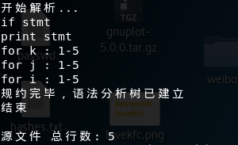
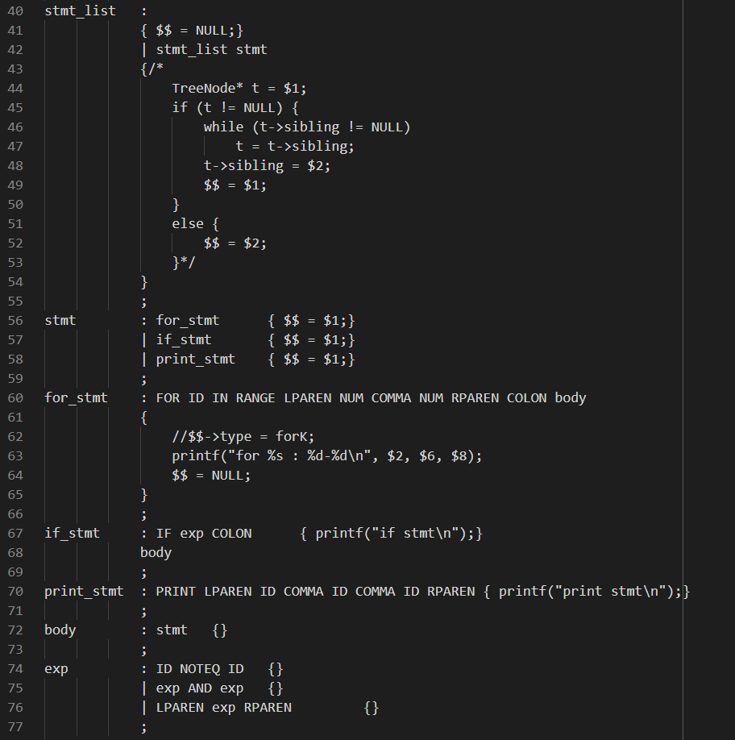

这是一个微型的python解释器，当然是为了温习flex&bison的知识而创作的


我希望这个解释器至少应该实现以下功能：

1. 运行一段简单的python代码，如

    ```python
    for i in range(1,5):
    	for j in range(1,5):
    		for k in range(1,5):
    			if( i != k ) and (i != j) and (j != k):
    				print (i,j,k)
    ```

2. 语法检查


目前就先这么多，之后再修改


目前的进度：

通过LR(1)推导式 完成了规范规约



文法如下：



