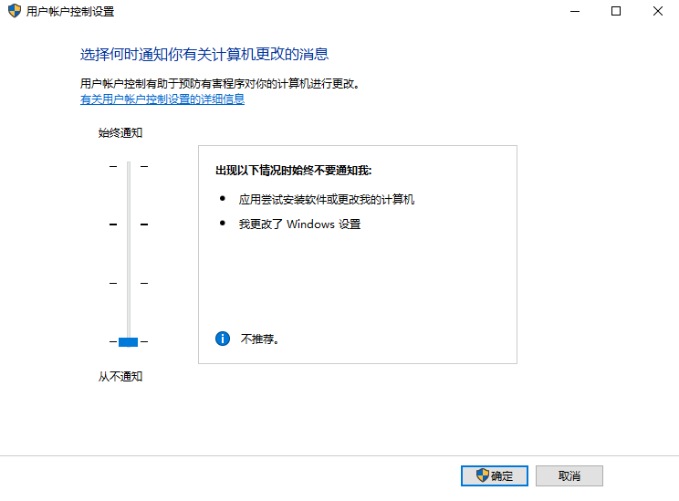

1. 取消用户账户控制提示

   

2. 按键精灵抓取坐标

   ```shell
   [Script]
   '==========以下是按键精灵录制的内容==========
   MoveTo -1691, 399
   Delay 3998
   LeftClick 1
   Delay 1376
   LeftClick 1
   Delay 64
   LeftClick 1
   MoveTo -852, 495
   Delay 5422
   LeftClick 1
   MoveTo 431, 229
   Delay 39663
   LeftClick 1
   '==========以上是按键精灵录制的内容==========
   ```

3. 改为 python 脚本

   ```
   
   ```


### 安装 pyuserinput

1. 安装 anaconda，会自动装好 pywin32

2. 在 `https://www.lfd.uci.edu/~gohlke/pythonlibs/#pyhook` 网站安装 pyhook

   选择对应的版本，我的是 python3.6

   `python -m pip install pyHook-1.5.1-cp36-cp36m-win_amd64.whl` 

3. 安装 pyuserinput

   `python -m pip install PyUserInput`
