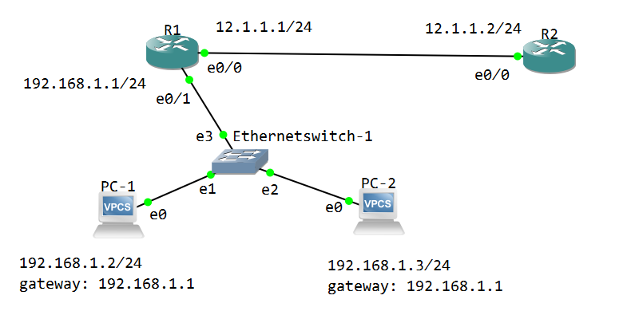

NAT（Network Address Translation，网络地址转换） 是为了减缓 IPv4 地址枯竭而推出的一项技术。NAT 将内网地址转换为外网地址。

在 IPv4 协议中，内网地址是如下的几个网段：

- A类地址中的 10.0.0.0 - 10.255.255.255
- B类地址中的 172.16.0.0 - 172.31.255.255
- C类地址中的 192.168.0.0 - 192.168.255.255

内网地址不能在公网上通信，只能用做内部组网使用。

如果内网中的设备想要上公网，一般在内网的边界路由器上配置 NAT，转换为 公网地址，然后接入因特网。

有三种 NAT 配置

1. 静态 NAT：手工配置的 一对一的映射



PC-1，PC-2 配好 ip，网关指向 R1

R1 看作边界路由器，R2 看作 ISP 的路由器

```shell
# R1 配置
conf t
	int e0/1
		ip addr 192.168.1.1 255.255.255.0
		ip nat inside
		no shut
		
		int e0/0
		ip addr 12.1.1.1 255.255.255.0
		ip nat outside
		no shut
		exit
	ip nat inside source static 192.168.1.2 192.168.1.20
	ip nat inside source static 192.168.1.3 192.168.1.30
	end

```

R2 配置 IP，然后开启 ICMP 调试 `debug ip icmp` 

使用 PC-1 ping R2，可以在 R2 看到 icmp 调试信息，源地址 12.1.1.2，目的地址 192.168.1.20，配置成功

在 R1 `show ip nat translations` 可以看到 NAT 转换表


2. 动态 NAT，维持一个公网IP池，增加灵活性

   拓扑不变，重新配置 边界路由 R1

   ```shell
   # R1
   conf t
   	ip nat pool p1 12.1.1.20 12.1.1.30 netmask 255.255.255.0
   	access-list 1 permit 192.168.1.0 0.0.0.255
   	ip nat inside source list 1 pool p1
   	end
   
   ```

3. PAT，端口地址转换

   ```shell
   # 重新配置 R1
   conf t
   	ip nat inside source list 1 interface e 0/0 overload
   	end
   
   ```


