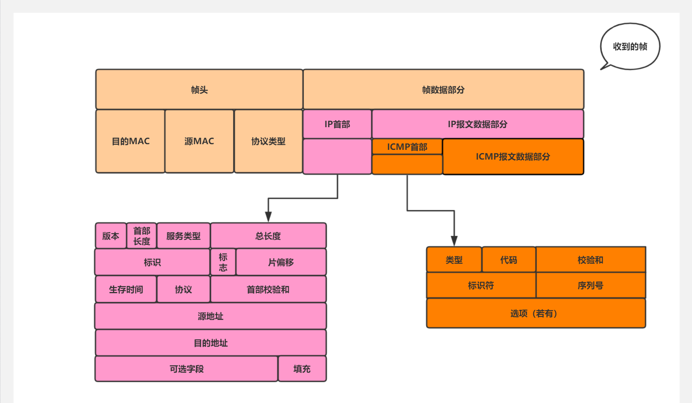
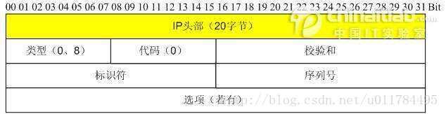
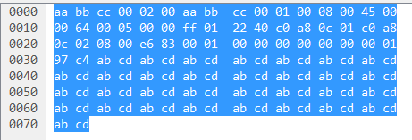
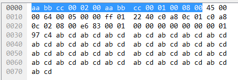
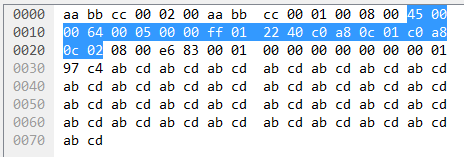
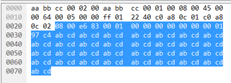
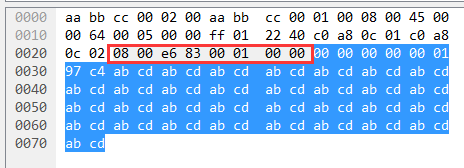

ICMP（Internet Control Message Protocal）因特网控制报文协议。它是 IPv4 协议族中的一个子协议，用于在 主机，路由器 之间传递控制消息。

ICMP 报文包含在 IP数据报中，如图：

当 IP报头中的协议字段值为1时，就说明这是一个 ICMP 报文。

ICMP 报文包括 IP报头（最少20字节），ICMP报头 和 ICMP 报文数据部分。如图：

- 类型：1字节，标识 ICMP 报文的类型，目前已定义了14中，可以分为两大类。取值1~127之间的差错报文和128以上的信息报文
- 代码：1字节，与类型字段共同标识 ICMP 报文的详细类型
- 校验和：2字节，这是对包括 ICMP 报文数据部分在内的整个 ICMP 报文的校验和，以检验报文在传输过程中是否出现了差错
- 其余字段不同的 ICMP 报文均不同

以一个实际的 ICMP 报文为例

这是一个以太网帧，帧头是

其中表示 目的MAC `aabb:cc00:0200`，源MAC `aabb:cc00:0100` ，上层协议类型是 `0800` 即 IPv4

IP首部是

IP首部包含 首部长度字段为 5，即 IP首部占 20字节

也包含了 总长度字段为 0x64，即 IP报文（首部+数据部分）占 100字节

数据部分的内容就是 ICMP 报文

其中 ICMP 首部是 

其余是 ICMP 数据部分，包含差错/查询信息

