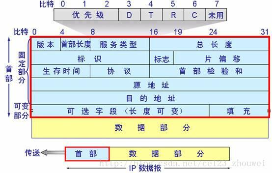

IP（Internet Protocal，网际协议）报文是在网络层传输的数据单元，也叫 IP数据报。报文包含 报文首部和数据部分，格式如下：

- 版本：占4位。现在一般为 IPv4（4）
- 首部长度：占四位，单位是4字节，最大可表示15，即首部长度被限制在60字节以内。当首部长度不是4字节的整数倍时，必须利用最后的填充字段加以填充。常用的首部长度是 20字节，这时可选字段为空且不需要任何填充。
- 服务类型：占8位，用来获得更好的服务。只有在使用区分服务（DiffServ）时，这个字段才起作用。一般不用。
- 总长度：指首部+数据的长度，单位是字节。因为长度字段占16位，所以数据报的最大长度是 65535字节。在IP层下面的每一种数据链路层都有自己的帧格式，其中包括帧格式中数据字段的最大长度，即最大传输单元（MTU）。当数据报被封装成链路层的帧时，如果此数据报的总长度超过链路层的MTU值，就需要分片。
- 标识：每产生一个数据报，该标识加一。当数据报长度超过链路的MTU值 而必须分片时，该标识字段就被复制到所有分片的标识字段中。含相同标识字段的分片在接收端被正确的重装为数据报。
- 标志（Flag）：占3位，目前仅有两位有意义。其中最低标记 MF（More Fragment）=1 表示后边还有分片，MF=0 表示已经是数据报的最后一个分片。中间的标记 DF（Dont Fragment）=1 表示不允许分片。
- 片偏移：占13位，表示分片在原分组中的相对位置，也就是相对用户数据字段的起点。片偏移以8字节为单位，即每个分片长度一定是 8字节的整数倍。
- 生存时间（TTL，Time To Live）：占8位，最大为 255，用于防止无法交付的数据报无限制的在网络中兜圈子，而白白浪费网络资源。每经过一个路由器就把 TTL-1，当TTL=0时，丢弃该报文。
- 协议：占8位，数据部分是何种协议，如 **0x06 表示 TCP，0x01 表示 ICMP**
- 首部校验和：占16位，这个字段只校验报文首部，而不包括数据部分。这是因为数据报每经过一个路由器，都要重新计算一下首部校验和（一些字段如生存时间，标志，片偏移等都可能发生变化），不校验数据部分可减少计算的工作量
- 源地址：32位 IP地址
- 目的地址
- 可变部分：首部的可变部分就是一个可选字段，从1到40字节不等，最后用全0的填充字段补齐4字节的整数倍。可变部分增加了IP数据报的功能，同时加大了每个路由器处理数据报的开销，但实际上这些选项很少被使用。在新的 IPv6中就将 IP数据报首部长度设为固定长度。

一些总结：

- IP报文首部的固定部分占20字节，可选部分长度不固定，所以 IP报文首部最小为 20字节。首部占4位，最大表示值15，所以 IP报文首部最大为 60字节。

- IP报文首部必须是 4字节的整数倍，否则必须用末尾的填充字段进行填充。

- 当 IP报文长度大于链路的最大传输单元（MTU）时，需要按照 IP协议的分片策略进行分片。

- 除最后一片外，分片的长度必须是 8字节的整数倍。（因为分片的偏移量单位是 8字节）。

