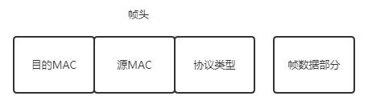

以太网是目前做流行的有线局域网技术，以太网的数据帧格式如下：

| 帧起始部分 | 目的MAC | 源MAC | 类型 | 数据     | FCS 帧校验序列 |
| ---------- | ------- | ----- | ---- | -------- | -------------- |
| 8B         | 6B      | 6B    | 2B   | 46~1500B | 4B             |

- 数据字段：在交换式以太网中，一台主机向局域网中的另一台主机发送 IP 数据报，这个数据报被封装在以太网帧结构中作为其有效载荷，以太网的最大传输单元（MTU）是 1500字节，也就是限制了一个 IP数据报最大为 1500字节，如果超过 1500字节，就要启动 IP协议的分片策略进行传输。同时，数据字段最小长度为 46字节，如果不够则必须填充到 46字节。如 IP数据报和填充部分会被网络层利用 IP数据报首部的长度字段去除相关填充。
- MAC地址：6个字节共128位的MAC物理地址，用于在局域网标识一台主机。目的MAC地址可以是某个主机（网卡）的物理地址，也可以是 ff:ff:ff:ff:ff:ff 广播MAC地址。接收端判断目的MAC地址，接收发给自己的数据帧并进一步处理，目的MAC不匹配则会丢弃。（将网卡置于混杂模式可接收发往其他主机的数据帧）
- 起始部分分为 前7个字节的 **前同步码** （10101010），用来使接收端的适配器在接收MAC帧时能够迅速调整时钟频率，使它和发送端的频率相同。以及 后一个字节的 **帧开始定界符** （10101011），告诉接收端准备接收，帧信息要来了。这部分不算做帧结构。
- 类型：共 2个字节，用来标识上层协议。如，该字段为0x0800时，有效载荷交付给 IP协议处理，为0x0806时交付给 ARP，为0x0835交付给 RARP
- 帧校验序列，使用 CRC-32 算法，检验该帧是否出现差错。

无效的 MAC帧：当出现以下情况之一即为无效的 MAC帧：

1. 帧的长度不是8的倍数
2. 检测序列校验出错
3. 帧数据字段长度不在46~1500之间

帧起始部分是接收帧之前的准备工作，帧校验序列是为了校验帧的完整性，因此以太网帧的结构可以看做如下：

接收端处理过程如下：

1. 检查目的MAC，不是发给自己的丢弃掉；
2. 计算CRC，如果帧校验出错则丢弃掉
3. 判断类型，将数据部分交给相对应的上层协议处理

