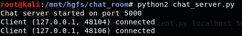
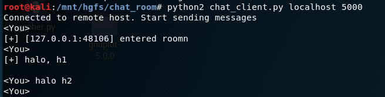
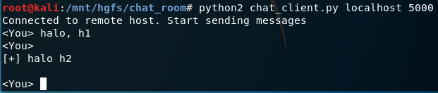
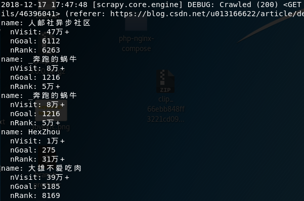

### 计算机网络课程报告

161620218

程斌


#### 聊天室

聊天室用 python socket 实现，socket 分为客户端和服务端

服务端使用 server_socket 监听请求，接收到客户端的连接请求时，就创建一个新的套接字与之配对，并用 server_socket 继续监听新的连接

客户端建立一个套接字 conn 发送连接请求，连接成功后使用 conn 直接与服务端通信

异步处理使用 select 模块，select 使用轮询机制。select 轮流检查列表中的套接字，套接字是一一对应的，如果远端有信息发送，那么对应的套接字就被加入到 read_sockets

服务端维护套接字列表 `server_socket, client1, client2 ...`， server_socket 是监听套接字，client1 与对应的客户端相连

如果 server_socket 收到消息，表示这是一个新的连接。如果 client1 收到消息，表示与之相连的客户端有信息发送，如果没有信息发送，则认为对方已经掉线（socket 在一方掉线后，对方会收到响应）。

客户端维护套接字列表 `stdin, s`，stdin 是标准输入，s 与服务端相连

如果 stdin 收到消息，表示客户端需要发送消息，如果 s 收到消息，表示接收到了服务端发来的消息








#### 爬虫

爬虫使用 python 的 scrapy 框架

从 CSDN 的一篇文章出发，爬取页面中的博客用户名，访问量，博主积分和全网排名，并继续追踪推荐栏中的文章

```python
from scrapy.spiders import Spider


class FirstSpider(Spider):
    name = "first"
    start_urls = ["https://blog.csdn.net/wbsrv/article/details/77131279"]

    def parse(self, response):
        name = response.css("p.name.csdn-tracking-statistics.tracking-click a#uid::text").extract()[0].strip()
        box = response.css("div.grade-box.clearfix dd::text").extract()
        nVisit = box[2].strip()
        nGoal = box[3].strip()
        nRank = box[4].strip()
        print("name: {}\n  nVisit: {}\n  nGoal: {}\n  nRank: {}".format(name, nVisit, nGoal, nRank))
        
        for next_page in response.css("div.recommend-item-box.recommend-box-ident.type_blog.clearfix div a::attr(href)").extract():
            yield response.follow(next_page, self.parse)
```



